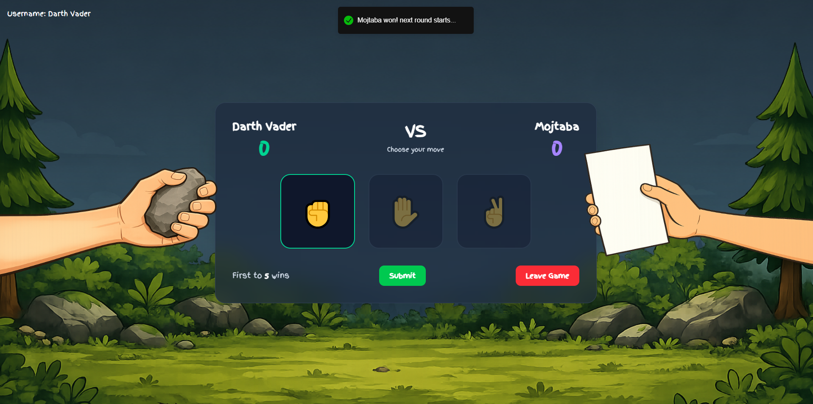

# Demo


# Online Rock Paper Scissors

A simple real-time **Rock Paper Scissors** game built to learn how WebSockets work in production applications. The project focuses on building a multiplayer game from scratch using **Socket.IO**, **Redis**, and **Node.js** without relying on frontend frameworks or SSR frameworks like Next.js.

---

## Goals

- Learn how real-time communication works using WebSockets.
- Understand Socket.IO's event-driven architecture.
- Manage multiplayer game sessions.
- Use Redis for temporary game state and room management.
- Perform server-side rendering with plain Node.js.
- Keep the architecture simple and educational.

---

## Tech Stack

| Technology          | Purpose                                          |
| ------------------- | ------------------------------------------------ |
| Node.js             | Backend server and server-side rendering         |
| Socket.IO           | Real-time bidirectional communication            |
| Redis               | Game room storage, session data, and matchmaking |
| Vite + Preact       | Client-side interface                            |
| Express             | HTTP server and routing                          |

---

## Running with Docker

### Prerequisites

- Docker
- Docker Compose

### 1. Clone the repository

```bash
git clone https://github.com/MojtabaOnTheNet/online-rock-paper-scissors.git
cd online-rock-paper-scissors
```

### 2. Build the Docker image

```bash
docker build -t online-rock-paper-scissors .
```

### 3. Start the application

```bash
docker compose up
```

Or, to run it in the background:

```bash
docker compose up -d
```

### 4. Open the application

Visit:

```
http://localhost:PORT
```

### 5. Stop the application

```bash
docker compose down
```

---

## Features

### Multiplayer Rooms

- Create a new game.
- Generate a unique room code.
- Join an existing room using the room code.
- Limit each room to two players.

---

### Real-Time Gameplay

- Instant player connections.
- Live move synchronization.
- Simultaneous move reveal.
- Automatic winner calculation.
- Play multiple rounds without refreshing the page.

---

### Redis Integration

Redis is used as temporary storage for:

- Active game rooms
- Room codes
- Connected players
- Player choices
- Match state
- Automatic room cleanup after disconnects or inactivity

Example room structure:

```json
{
  host: {
    name: "John",
    choice: "Rock",
    points: 2
  }, {
    name: "Doe",
    choice: "Paper",
    points: 3
  }
}
```

---

### Server-Side Rendering

Instead of using a framework like Next.js, pages will be rendered directly by Node.js, using the build option on Vite.

Benefits:

- Learn how SSR works internally.
- Full control over HTML generation.
- Faster understanding of the request-response lifecycle.

Static assets such as CSS, JavaScript, and images will be served by Express.

---

## WebSocket Events

| Event          | Description                     |
| -------------- | ------------------------------- |
| `create-room`  | Create a new game room          |
| `join-room`    | Join an existing room           |
| `play`         | Submit answer                   |
And more...

---

## Project Structure

```
├── Dockerfile
├── README.md
├── backend
│   ├── db.js
│   ├── node_modules
│   ├── package-lock.json
│   ├── package.json
│   ├── server.js
│   ├── socket.controllers.js
│   └── utils.js
├── demo.png
├── docker-compose.yml
└── frontend
    ├── index.html
    ├── jsconfig.json
    ├── node_modules
    ├── package-lock.json
    ├── package.json
    ├── public
    ├── src
    └── vite.config.js
```

---

## Game Flow

```text
Player A
    │
Create Room
    │
Generate Code
    │
Store Room in Redis
    │
──────────────
Player B joins
    │
Socket.IO connects both players
    │
Start Round
    │
Players choose moves
    │
Server receives both choices
    │
Determine winner
    │
Broadcast results
    │
Play Again
```

---

## Learning Objectives

By completing this project, I'll gain experience with:

- WebSocket fundamentals
- Socket.IO events and rooms
- Multiplayer application design
- Redis data modeling
- Temporary state management
- Server-side rendering without frameworks
- Node.js HTTP lifecycle
- Express middleware
- Event-driven programming
- Client-server communication
- Disconnect handling
- Clean project architecture

---

## Possible Future Improvements

- Better game functionality
- Chat implementation
- better UI

---

## Project Philosophy

This project prioritizes learning over complexity. Every major component—HTTP handling, server-side rendering, WebSocket communication, and Redis state management—is implemented directly using Node.js and its ecosystem to provide a clear understanding of how real-time web applications function under the hood.
